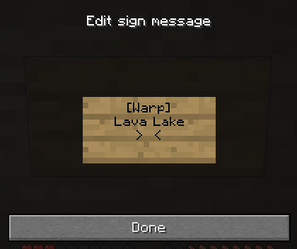
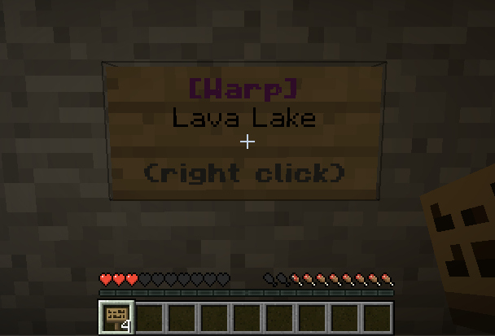
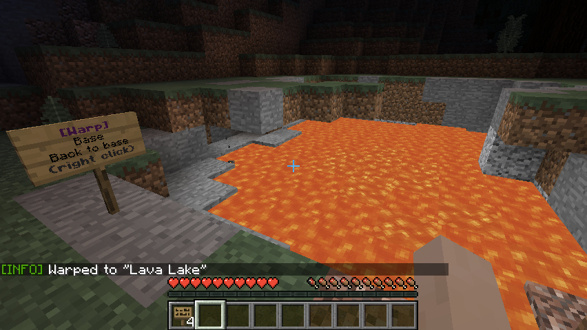

cuberite-simplewarps
====================
A [Cuberite](https://cuberite.org/) plugin to manage and use named warp locations.

Commands
--------
| Command            | Permission           | Description                          |
|--------------------|----------------------|--------------------------------------|
| `/warp to <name>`  | `simplewarps.use`    | Warp to a warp point                 |
| `/warp ls`         | `simplewarps.list`   | List available warp points           |
| `/warp set <name>` | `simplewarps.set`    | Set current location as a warp point |
| `/warp rm <name>`  | `simplewarps.remove` | Remove a warp point                  |

Signs
-----
Signs can be used as interactive warp points by creating them with the format:
```
[Warp]
<warp point name>
<optional extra text>
```

After editing, the text on the sign will change to signify that the format was accepted. Any player
with the `simplewarps.use` permission can then right click on the sign to be teleported to the named
warp point (if it exists).

### Example




